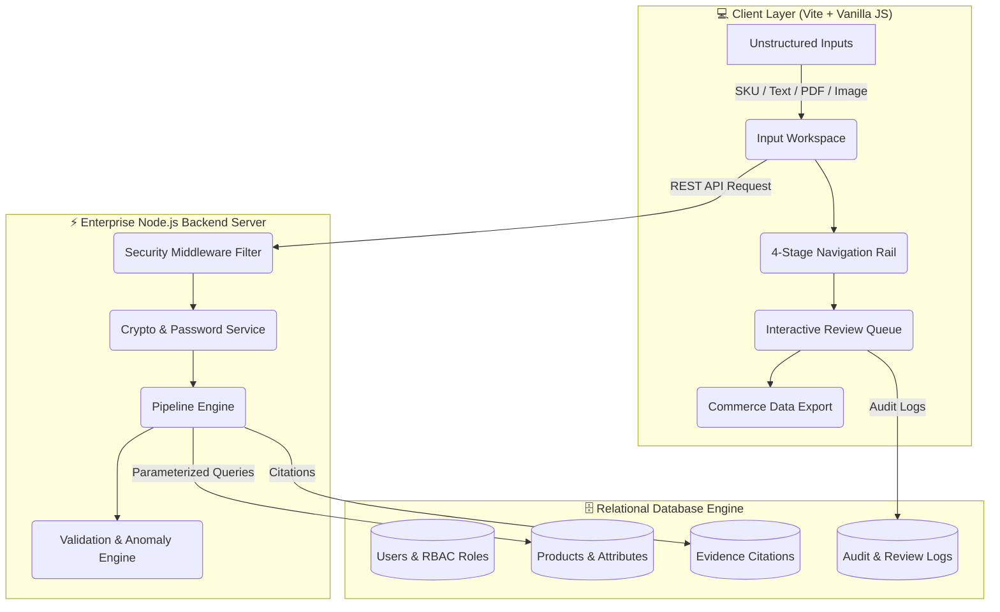

<div align="center">

# ⚡ Product Intelligence — Industrial Commerce Engine

### _Enterprise AI-Powered Product Data Intelligence, Normalization & Security Engine_

[](https://vitejs.dev/)
[](https://developer.mozilla.org/en-US/docs/Web/JavaScript)
[](https://nodejs.org/)
[](https://vitest.dev/)
[](https://github.com/STRAW_HATS/product-intelligence/actions)
[](https://github.com/STRAW_HATS/product-intelligence)
[](LICENSE)

<br/>

[](https://vercel.com/new/clone?repository-url=https://github.com/STRAW_HATS/product-intelligence)
&nbsp;&nbsp;
[](https://app.netlify.com/start/deploy?repository=https://github.com/STRAW_HATS/product-intelligence)

</div>

---

## 🎥 Live Interactive Preview


---

## 📖 Executive Overview

**Product Intelligence** is an enterprise-grade AI intelligence platform engineered for industrial manufacturers, B2B distributors, and e-commerce catalogs. It ingests unstructured & fragmented product inputs (SKU codes, technical PDFs, spec sheets, supplier copy, and images) and normalizes them into **structured, evidence-linked, commerce-ready records**.

---

## 🌟 Key Platform Modules & Capabilities

| Module Icon | Feature Name                     | Description & Capabilities                                                                                                           |
| :---------: | -------------------------------- | ------------------------------------------------------------------------------------------------------------------------------------ |
|     📥      | **Input Workspace**              | Multi-modal ingestion of SKU codes, supplier text copy, technical PDF data sheets, and product images with 1-click preset loaders.   |
|     ⚙️      | **Industrial Extraction Engine** | Rule-based & regex technical attribute parser with confidence scoring ($0-100\%$) and automated citation linking.                    |
|     🎛️      | **Interactive Filter Pills**     | Instant 1-click attribute filtering by `All`, `Reviewed`, `Extracted`, `Inferred`, and `Pending Review`.                             |
|     🗄️      | **Product Database Explorer**    | Real-time modal inspection of products stored in the relational database with 1-click loading into the workspace.                    |
|     🔐      | **PBKDF2 User Auth Modal**       | Enterprise authentication modal issuing signed HMAC JWT session tokens with PBKDF2 password encryption.                              |
|     ⚡      | **7-Stage Pipeline Engine**      | Asynchronous execution pipeline: `Ingestion` → `Parsing` → `Extraction` → `Enrichment` → `Validation` → `Human Review` → `Export`.   |
|     📊      | **Live KPI Analytics Bar**       | Real-time workspace metrics calculation: Total Attributes, Avg Confidence Score, Validation Quality Grade, and Pending Review items. |
|     🔍      | **Evidence Traceability**        | Every extracted attribute links directly to source document citations, page numbers, and exact text snippets.                        |
|     🛡️      | **Validation & Anomaly Engine**  | Real-time confidence scoring ($0-100\%$), missing attribute detection, unit standardization, and taxonomy rules.                     |
|     👥      | **Human-in-the-Loop Review**     | Inline attribute editing, single-click approvals/rejections, reviewer notes, bulk operations, and multi-step undo (`Ctrl+Z`).        |
|     💾      | **Database Auto-Persistence**    | File-backed database serialization (`server/db/data.json`) + `localStorage` client state auto-recovery on restart.                   |
|     📦      | **Multi-Format Handoff**         | One-click export and clipboard copy for **Full JSON**, **CSV Flat File**, and **PIM-ready JSON**.                                    |

---

## 🏗️ System Architecture & Data Flow



---

## 🔒 Enterprise Security & Database Matrix

- 🛡️ **PBKDF2 Password Encryption**: Cryptographic PBKDF2 hashing with unique 16-byte random salts (`crypto.randomBytes()`) and 10,000 iterations to eliminate dictionary & rainbow table attacks.
- 🛡️ **Timing Attack Protection**: Constant-time hash verification (`crypto.timingSafeEqual()`) preventing side-channel execution timing analysis.
- 🛡️ **HMAC SHA-256 JWT Authentication**: Stateless JWT signature generation and verification for session control.
- 🛡️ **SQL Injection Immunity**: Database query engine using parameterized query binding (`sanitizeSqlParam()`) and constraint rules.
- 🛡️ **XSS Sanitization**: Dynamic HTML escaping (`sanitizeInput()`) on all client rendering.
- 🛡️ **Content Security Policy (CSP)**: Strict headers restricting script origins, font sources, and connect endpoints.
- 🛡️ **File Payload Security**: MIME type & extension whitelisting (`.pdf`, `.png`, `.jpg`, `.webp`) with a strict 10MB limit.
- 🛡️ **Rate Limiting**: Request throttling (`pipelineRateLimiter`, max 5 requests / 10 sec window).
- 🛡️ **Authentication & RBAC**: Session permission guards preventing Unauthorized/Viewer role modifications.

---

## 🔌 REST API Specification Overview

| Endpoint                 | Method | Security Guard  | Description                                                       |
| ------------------------ | :----: | :-------------: | ----------------------------------------------------------------- |
| `/api/v1/health`         | `GET`  |     Public      | System health check & version info                                |
| `/api/v1/auth/register`  | `POST` |     Public      | Register user account with PBKDF2 password encryption             |
| `/api/v1/auth/login`     | `POST` |     Public      | Authenticate credentials and issue signed JWT token               |
| `/api/v1/pipeline/run`   | `POST` |  Rate Limiter   | Execute extraction pipeline and persist record to database        |
| `/api/v1/products`       | `GET`  |   JWT Bearer    | Fetch product record, attributes, and evidence citations          |
| `/api/v1/reviews/action` | `POST` | RBAC Role Guard | Record human review action (Approve, Edit, Reject) with audit log |

---

## 🚀 Quick Start Guide

### Prerequisites

- **Node.js** v18+
- **npm** v9+

### Installation & Local Setup

```bash
# 1. Clone repository
git clone https://github.com/STRAW_HATS/product-intelligence.git
cd product-intelligence

# 2. Install dependencies
npm install

# 3. Start local frontend development server
npm run dev

# 4. Start Node.js backend HTTP API server
npm run server

# 5. Run Vitest automated test suite (6 coverage modules)
npm run test

# 6. Build for production
npm run build
```

Frontend local server: `http://localhost:5173`  
Backend API server: `http://localhost:5000`

---

## 🧪 Automated Testing Suite Matrix

Configured with **Vitest** ([vite.config.js](vite.config.js)) for high reliability:

```bash
npm run test
```

### 6 Test Coverage Modules:

1. `src/__tests__/pipeline.test.js` — Pipeline engine & fallback SKU generator
2. `src/__tests__/validation.test.js` — Validation rules & anomaly detection engine
3. `src/__tests__/export.test.js` — Full JSON, CSV, and PIM format builders
4. `src/__tests__/security.test.js` — XSS escaping, file upload bounds, and rate limiting
5. `src/__tests__/auth.test.js` — RBAC permissions, role switching, and password rules
6. `src/__tests__/backend.test.js` — Database persistence, PBKDF2 hashing, JWT signing & SQLi immunity

---

## ⌨️ UX Keyboard Shortcuts

|     Shortcut     | Action                                         |
| :--------------: | ---------------------------------------------- |
| `Ctrl` + `Enter` | Submit Input Form / Approve Active Review Item |
|   `Ctrl` + `S`   | Quick Export Full Product JSON Record          |
|   `Ctrl` + `Z`   | Undo Last Review Queue Action                  |
|      `Esc`       | Cancel Inline Attribute Editing                |

---

## 📄 Documentation Links

- 📘 [API Specification & Data Schemas](API_DOCUMENTATION.md)
- 💾 [Disaster Recovery & Backup SOP](BACKUP_RECOVERY.md)
- 📊 [13-Point Quality & Audit Report](C:\Users\dhake.gemini\antigravity-ide\brain\04982c0f-3423-47a6-a8a3-fb7d3174db0e\audit_report.md)

---

<div align="center">

Made with ❤️ by **Team STRAW_HATS**  
_Licensed under the [MIT License](LICENSE)_

</div>
